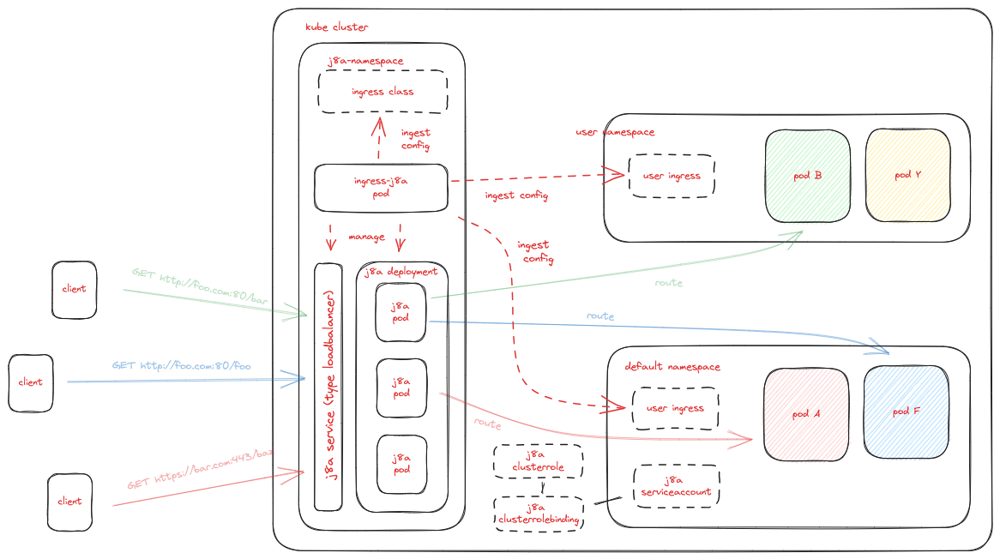

  

# Why?
This document outlines the design of an Ingress Controller for [j8a](https://github.com/simonmittag/j8a) inside a 
Kubernetes cluster. The Ingress Controller is responsible for managing incoming network traffic to services within the 
cluster, providing an entry point for external clients to access the cluster's applications. The controller utilizes the 
Ingress resource, along with other Kubernetes objects such as Service, ConfigMap, and Secret, to facilitate routing 
and load balancing of network traffic.

# What?
`ingress-j8a` is a kubernetes ingress controller pod, exposing ports 80, 443 of the cluster to the internet. It generates the configuration
objects for j8a a proxy server, keeps those configurations updated and manages instances of j8a within the cluster. 

* ingress-j8a consumes ingress resources from all namespaces for the ingressClass j8a
* ingress-j8a consumes the actual ingressClass resource that specifies the controller class itself and reconfigures the controller pods accordingly.
* ingress-j8a deploys instances of j8a into the cluster by talking to the kubernetes API server. It creates a deployment keeping multiple copies of j8a alive.
* ingress-j8a updates deployments of j8a instances with new configuration objects as env variables. Since this cannot be done at runtime, it changes the deployment of j8a-ingress-controller-pod and rolls out new pods using a rolling update, so there is always live pods available. old pods are shut down after new ones have successfully deployed.

# How?
## Design Goals
* Zero downtime deployments for j8a during updates to all cluster resources.
* Redundancy for j8a with multiple proxy server instances and a load balancing mechanism
* intelligent defaults for j8a for proxy server params the kubernetes ingress resource does not readily expose.

## Resource Lifecycle
The basic mechanics of monitoring kubernetes for configuration changes,
then updating J8a's config and it's live traffic routes.

1. The user deploys ingress resources to the cluster, or updates them. This is similar for dependent resources such as configMap and secrets that are used by the ingress resources. The user is allowed to deploy these at any time.
2. A cache that runs inside `ingress-j8a` monitors for updates to kube resources in all namespaces. It pulls down the latest resources, caches them, then versions its own config.
3. The control loop inside `ingress-j8a` that continuously waits for config changes is notified (this idea is borrowed from ingress-nginx).
4. The control loop reads the versioned, cached config out and generates a j8a config object in yml format. This is based on a template of the j8a config, filled in using go {{template}} variables. The result will be deployed to the kube cluster as its own configmap object in the j8a namespace (not currently on the diagram).
5. `ingress-j8a` then deploys the configMap as a resource to the kube api server and keeps it updated for subsequent changes.
6. kube api server deploys this resource into the cluster and maintains it there. 
7. `ingress-j8a` then tells kube api server to deploy the latest docker image of j8a into the cluster using this config. It updates the current deployment for j8a and deploys new pods into that deploying using a rolling configuration update. 
8. 🚧 kube api-server creates the deployment. Several problems need to be solved here. 
   * It will need to be configured from the configmap. 
   * it needs to run on some kind of nodeport config on each node? listening on the same port on every node. 
   * we need it's external IP address
   * we may need to create an external NLB for it? (how would we even know about this?)

# Contributions

The ingress-j8a team welcomes all [contributors](https://github.com/simonmittag/ingress-j8a/blob/master/CONTRIBUTING.md). Everyone
interacting with the project's codebase, issue trackers, chat rooms and mailing lists is expected to follow
the [code of conduct](https://github.com/simonmittag/ingress-j8a/blob/master/CODE_OF_CONDUCT.md)
